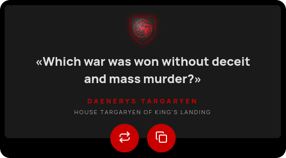

# GoT Quotes Chrome Extension

This is a GoT Quotes Chrome extension created using [React](https://react.dev) and [Vite](https://vitejs.dev/) with TypeScript.

<p align="center">
  
</p>

## Features

- Chromium-based browser extension, following Manifest V3.
- The extension's appearance changes according to the quote author's house.
- Heraldry and emblematic colors of more than 80 noble houses.
- Copy your favorite quotes easily to share them.

## Getting Started

### Prerequisites

Make sure you have [Node.js](https://nodejs.org/) installed on your machine.

### Setup

1. Clone the repository.

2. Go to project folder.

3. Install the dependencies:

```sh
npm install
```

## Development

To start the development server:

```sh
npm run dev
```

This will start the Vite development server and open your default browser.

## Build

To create a production build:

```sh
npm run build
```

This will generate the build files in the `build` directory.

## Load Extension in Chrome

1. Open Chrome and navigate to `chrome://extensions/`.
2. Enable "Developer mode" using the toggle switch in the top right corner.
3. Click "Load unpacked" and select the `build` directory.

## Credits

- Starting template forked from [React Chrome Extension Template](https://github.com/5tigerjelly/chrome-extension-react-template).
- Heraldry obtained from [Game of Thrones Fandom Wiki](https://gameofthrones.fandom.com/wiki/Heraldry).
- Quotes provided by [Game of Thrones Quotes API](https://gameofthronesquotes.xyz).
